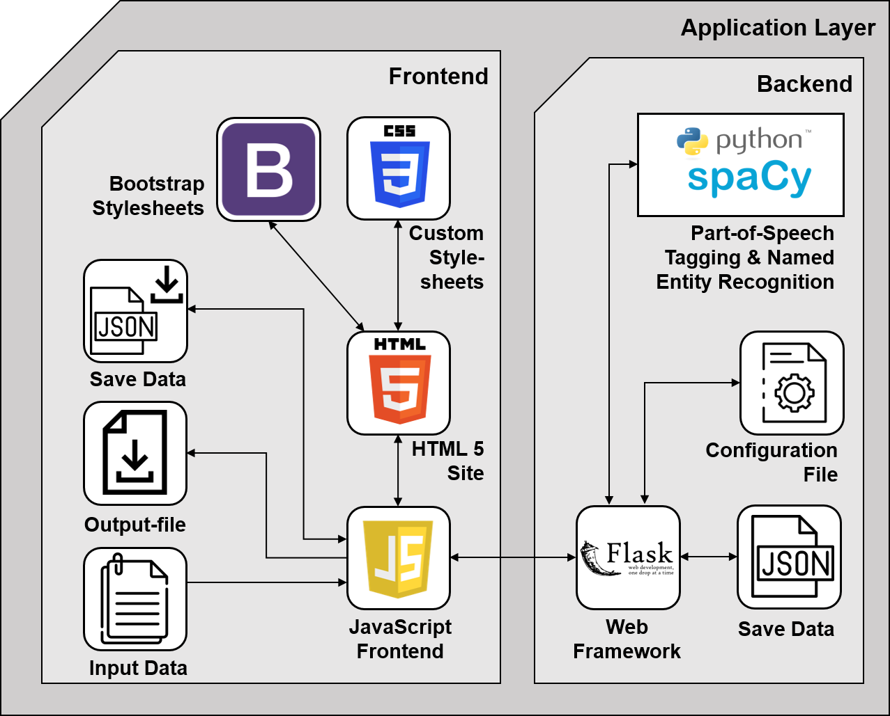

<div style="display: flex">
  

</div>

# AnnIE - Annotation Platform

Tool for open information extraction annotations using text files.
The output is delivered in .tsv-files

### Installation:

The following manual is based on Python 3.7 or higher, running on Windows. In the case of running on Linux, use "pip3" and "python3" instead of "pip" and "python".

First install all required modules, preferable into a venv:

```console
pip install -r requirements.txt
```

Then start the tool, running:

```console
python openie.py
```

By executing, the CMD should show the line 'Running on http://127.0.0.1:5789/ '.
A browser window of your standard browser should be opened automatically.
If not, open a browser and go to http://127.0.0.1:5789/.
In case the port differs to 5789, the port value in the URL inside the index.html has to be adjusted coherently.
The UI of AnnIE should be displayed as follows:

<div style="display: flex">
  

</div>

### Hosting the tool

In case the tool is hosted on a server, the AnnIE-server files should be used. These are provided inside the "annie-server.zip".
The endpoint URL inside the App.js file, line 5, needs to be set to the tool's URL, on which it is bound.
The server version can be started executing the following two commands:

```console
pip3 install -r requirements.txt
gunicorn --bind 0.0.0.0:80 --workers=4 openie:app
```

### Settings

The settings of the tool can be adjusted in the config.json file.

Accepted values are:

- "Language": English, German, French, Chinese
- "POSLabels": true, false
- "Coloring": all, verbs, named-entities, none
- "Word-sort": true, false
- "Compound-words": true, false
- "Quotation-marks": true, false
- "Named-Entities": true, false
- "Show-Indices": true, false

By changing the value of "Language", the used spacy language model can be adjusted to the desired language.
By enabling "POSLabels", all applied labels to the tokens are shown inside the application in small boxes underneath the token's text.
Changing the value of "Coloring", the color diversity for highlighting the different labels can be adjusted.
If "Word-sort" is enabled, all selected words are put in the correct order of their appearance.
If this is disabled, they are in the order of having been clicked on.
By enabling "Compound-words", these type of words is not split by their "-".
By enabling "Quotation-marks", these are shown in their own word boxes.
Disabling "Named-Entities" will turn off NER labeling.
Disabling "Show-Indices" will display the output without any indices after the tokens.

### Special Features

As long as the "CTRL"-button is pressed, you can hover over words to select them faster
then by clicking on every word explicitly.

### Adding languages

For integrating additional languages to the tool, search for the spacy language model name of the required language here: https://spacy.io/models.
Then add to the POS_Tagger.py file into the last row of the definition "read_config_file(self)"
following lines by substituting the variables SPACY_MODEL_LANGUAGE with the spacy model name and DESIRED_LANGUAGE with the name of the added language
(e.g.: SPACY_MODEL_NAME=en_core_web_sm ==> DESIRED_LANGUAGE=English ):

```python
if configs["Language"] == "DESIRED_LANGUAGE":
    try:
        self.nlp = spacy.load("SPACY_MODEL_NAME")
    except:
        if platform.system() == "Windows":
            os.system('python -m spacy download SPACY_MODEL_NAME')
        else:
            os.system('python3 -m spacy download SPACY_MODEL_NAME')
        self.nlp = spacy.load("SPACY_MODEL_NAME")
    print("Successfully loaded language: DESIRED_LANGUAGE")
```

To get the application running with the labels in the new language, do not forget to set the required "Language"-field in the config.json file to the value of DESIRED_LANGUAGE.

### Token Labeling

To highlight additional parts of the text and to attach different labels to tokens, the Tagger class within the tokenizer.py files needs to be adjusted in the first step.
Within this Tagger class, the "tag_input" definition can be adjusted in a way so that the input text gets other labels or uses other models for POS-Tagging.
This definition is called every time the application sends a sentence of the input text to its backend with the request to get this sentence back together with labels.
The input to this definition is a string value containing for example a sentence. This sentence is then in the first step labeled by applying POS-Tagging on each contained token using spacy.
Each word of the input is saved as an own TaggedWord object which includes next to the text representation of the word the "labels" field in which the tag label needs to be stored and its index within the sentence.
In the next step, the labels of tokens which are recognized as named-entities are overwritten to include the NER-Tags instead of the POS-Tags as labels, if this functionality is enabled in the config file.
To further proceed, special cases like the appearance of quotation marks and compound words are further handled depending on the set values in the configurations.
If additional labels, next to the existing ones, should be added, the easiest way is to copy the if-clause for named entity labeling (lines 101 to 117) and adjust it to overwrite the PoS-Labels with the new required labels for the relevant tokens.
Now the new labels are simply shown within the tool underneath the token's text if "POSLabeling" is enabled in the configurations.

```python
    """Tags each input word with an according Label depending on the previous set configuration

    Args:
        text (str): The text containing the words (=tokens) which will be tagged with labels

    Returns:
        list: A list of TaggedWord elements representing each word of the input text with additional information,
                of the tokens index and its label content.
    """

    def tag_input(self, text):
        result = []
        counter = 0
        doc = self.nlp(text)

        # Apply POS-Tagging as Labels to the tokens
        for token in doc:
            tagged_word = TaggedWord(word=str(token.text), index=counter, label=str(token.pos_))
            result.append(tagged_word)
            counter += 1

        # Replace the previous set POS-Tags with NER-Tags if they are enabled in the configs
        if self.named_entites:
            for i in range(len(doc.ents)):
                if doc.ents[i].text in text:
                    entity = doc.ents[i].text
                    ent_label = doc.ents[i].label_
                    if ' ' in entity:
                        entity = entity.rsplit(' ')
                        for ele in result:
                            for ent in entity:
                                if ent == ele.word:
                                    ele.label = str(ent_label)
                    else:
                        for ele in result:
                            if entity == ele.word:
                                ele.label = str(ent_label)

        # Filters the input text for special cases like quotation marks and compound words
        changed = False
        if self.compound_words:
            #....
```

In case of complete customizations, the tagging functionalities can also be completely exchanged. In this case, it is important to ensure that the new definitions still
output a list of TaggedWord elements to ensure the correct further processing and transmission to the application's frontend.

### Word Highlighting

<p>
  
</p>
Example of included coloring scheme's.

In case the new labels are required to be displayed in a different color, the application's frontend needs to be adjusted accordingly:
For adjusting the color scheme, the color “hex”-values inside the style.css files need to be set to the desired color codes. This needs to be done to the token button itself with the desired color as well as to the “hover” property of the button, where usually a darker version of the same color is used. If complete new labels are introduced to the tool, the CSS needs to include an appropriate class to handle these.

```css
/*Add YOURLABEL class to css file */
.btn-YOURLABEL {
  color: white;
  background-color: #87ff00;
  border-color: #87ff00;
  opacity: 0.5;
}
.btn-YOURLABEL:hover,
.btn-YOURLABEL:focus {
  color: white;
  background-color: #75de00;
  border-color: #75de00;
}
```

In case complete new coloring schemes are required, these can either be entered additionally or be exchanged against the standard functions implementing the included schemes. The different colorings are applied using the functions "fullColoring()", "verbColoring()", "namedEntitiesColoring()", and "noneColoring()" inside the "GraphicalInterface.js". These functions can be adjusted by changing the switch statements handling which tokens need to be colorized depending on their label. There, new cases can simply be added or superfluous colored labels can be removed.

```js
// Create new color labeling function
function yourLabelColoring(labelText, labelPos, index) {
  let output = "";
  switch (labelPos) {
    // Remove/adjust/add cases
    case "NOUN":
      output += `<button class="btn btn-noun ml-1 mb-1" id="posLabel-${index}"> `;
      break;
    case "VERB":
      output += `<button class="btn btn-verb ml-1 mb-1" id="posLabel-${index}">`;
      break;
    case "ADJ":
      output += `<button class="btn btn-adjective ml-1 mb-1" id="posLabel-${index}">`;
      break;
    case "ORG":
    case "GPE":
    case "LOC":
    case "PERSON":
      output += `<button class="btn btn-namedEntity ml-1 mb-1" id="posLabel-${index}">`;
      break;
    case "YOURLABEL":
      output += `<button class="btn btn-YOURLABEL ml-1 mb-1" id="posLabel-${index}>`;
      break;
    default:
      output += `<button class="btn btn-secondary ml-1 mb-1" id="posLabel-${index}">`;
      break;
  }
  if (showTag) {
    output += `<text>${labelText}</text> <span class="badge badge-secondary">${index}</span><br/><pos>${labelPos}</pos></button>`;
  } else {
    output += `<text>${labelText}</text> <span class="badge badge-secondary">${index}</span><pos hidden>${labelPos}</pos></button>`;
  }
  return output;
}
```

To add new coloring functions, it is possible to let them rely on the provided ones. Simply "register" them to the tool by adding them to the first switch-statement inside the function "createTaggedContent()". An example of how to do this in the code is shown below. The tool requires to work properly, to additionally adjust the function "downgrade()".

```js
// Register new labeling scheme:
function createTaggedContent(words) {
    var output = "";
    for (var i=0; i < wors.length; i++) {
        let labelText = words[i].text;
        let labelPos = words[i].posLabel;
        let type = words[i].type;
        let index = words[i].index;
        if (type == '') {
            switch (coloring) {
                case 'full': output += fullColoring(labelText, labelPos, index); break;
                case 'verbs': output += verbColoring(labelText, labelPos, index); break;
                case 'named-entities': output += namedEntitiesColoring(labelText, labelPos, index); break;
                case 'none': output += noneColoring(labelText, labelPos, index); break;
                //"Register" new created coloring function by replacing yourLabelColoring with your new function's name
                case 'YOURLABEL': output += yourLabelColoring(labeltext, labelPos, index); break;
                // End adjustments
                default: output += verbColoring(labelText, labelPos, index); break;
            }
    }
}

// ...

// Adjust downgrade function
function downgrade(targetElement) {
    //...
    else {
        //Insert if-statement for YOURLABELCOLORING
        if (coloring == 'YOURLABELCOLORING') {
            switch (posLabel) {
                case 'NOUN': targetElement.className = "btn btn-noun ml-1 mb-1"; break;
                case 'NOUN': targetElement.className = "btn btn-verb ml-1 mb-1"; break;
                case 'NOUN': targetElement.className = "btn btn-adjective ml-1 mb-1"; break;
                case 'ORG':
                case 'LOC':
                case 'PERSON':
                case 'GPE': targetElement.className = "btn btn-namedEntity ml-1 mb-1"; break;
                // Add case for YOURLABEL
                case 'YOURLABEL': targetElement.className = "btn btn-YOURLABEL ml-1 mb-1"; break;
                // End adjustments
                default: targetElement.className = "btn btn-secondary ml-1 mb-1"; break;
            }
        }
    }
    //...
}

```

### General Code Structure

AnnIE high-level architecture diagram & Data model

<div>
  
  
</div>

In the following, a list is shown pointing out the relevant functionalities of each source code part:

Frontend JavaScript files (in the directory ./static/js):

- App.js: Implements the application's main controller, handles the system logic. Includes the functions for file upload, loading of used files, loading of the configuration settings, as well as the general application logic for handling clusters, triples, etc., by applying EventListeners.
- DataStructure.js: Contains the internal data models on which the application relies. An input text is processed as an Annotation object which itself contains the file data besides the clustering data for each sentence of the input. The Cluster consists out of one or multiple Triples, which are organized in Word objects. The detailed data model is shown above.
- GraphicInterface.js: This file handles everything related to the visualization of the tokens, tags, clusters, and triples. Besides that, the markdown functions are included there.
- LoadSave.js: Saves and loads the current annotation progress with all selected cluster data into JSON files. These files are saved within the "data"-folder.
- Output.js: Creates the text representation of the annotated clusters and triples and displays them at the bottom. The text representation is offered to be downloaded as a .tsv text file.
- Tokenizer.js: Splits the input text into sentences and sends the text sentence-wise to the backend with the request to perform tokenization on it.
- Visual.js: Includes helper functions that are applied to the tokens and the selection buttons to work properly. Can be seen as an extension of the GraphicInterface.js file.

Python files (Backend):

- <span>openie.<span>py: Implementation of the server functionalities, hosting a flask server locally on port 5789, and opening the system's default browser. Offers the required endpoints for the frontend.
- <span>tokenizer.<span>py: Includes the class Tagger and TaggedWord. Applies Part-of-Speech tagging and Named-Entity Recognition on the input data using the spacy module for python.

### Usage Example

In the following an example for annotating a sample sentence from the Guardian:

<div style="display: flex">
  
</div>

A short video going through AnnIE showing its functionalities can be found here: https://drive.google.com/file/d/1E1gB_-zKE70jnw75LMYj1kkAMsMh37TA/view?usp=sharing

### Acknowledgements

Developed by Niklas Friedrich, Kiril Gashteovski, Minying Yu, Bhushan Kotnis, Carolin Lawrence, Mathias Niepert, and Goran Glavas.

This tool has been developed at the Natural Language Processing and Information Retrieval Group at the University of Mannheim.
